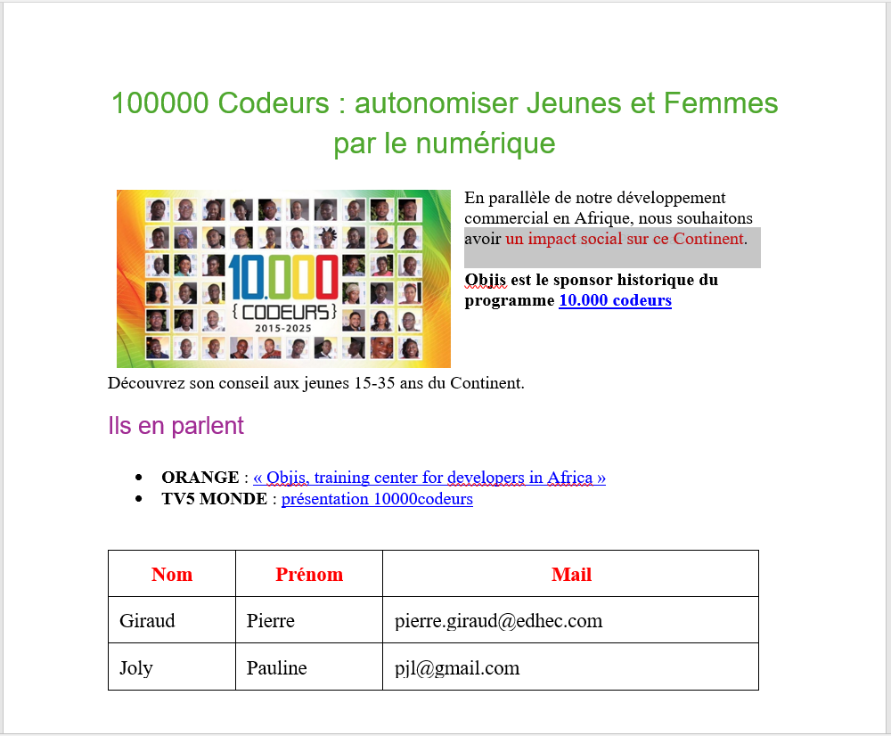

<h1>HTML et CSS par la pratique </h1>

Ce TP consiste à transcrire un fichier word (voir capture) en utilisant les langages HTML et CSS.

<a href="https://sidoniegit.github.io/Tp-html-css-reponsive/">Voir démo</a>
